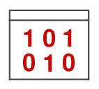

# Thème 3 : Les données

{align=left}
        
L'informatique étant le traitement automatique de données,  ces données constituent la matière première de toute activité numérique.
        
Afin de permettre leur réutilisation, il est nécessaire de les conserver de manière persistante.
        
Les structurer correctement garantit que l’on puisse les exploiter facilement pour produire de l’information.


## Expériences de traitement

<center><iframe width="560" height="315" src="https://www.youtube.com/embed/IJJgcZ2DEs0" title="YouTube video player" frameborder="0" allow="accelerometer; autoplay; clipboard-write; encrypted-media; gyroscope; picture-in-picture" allowfullscreen></iframe></center>

**Découvrir** la manipulation de données sur [la plateforme France-IOI](https://concours.castor-informatique.fr/){target=_blank} avec les codes :

- `tiw7phe9` pour l'activité n°1 ;
- `6igpd943` pour l'activité n°2 ; 
- `pcj3ddrh` pour l'activité n°3 ;

<!-- 
OU sur la nouvelle mouture de la plateforme : [Les données structurées et leur traitement](https://parcours.algorea.org/contents/4707-4701-1067253748629066205-653650670442840123/){target=_blank}

 
???- success "Solutions"

    === "n°3_1 - Les régions et leur capitale"

        ```python
        from database import *
        table_regions = loadTable("regions")
        displayTable(table_regions)
        ```

    === "n°3_2 - Les grandes villes"

        ```python
        from database import *
        table_grandes_villes = loadTable("grandes_villes")
        displayTableOnMap(table_grandes_villes,"ville","longitude","latitude")
        ```
    
    === "n°3_3 - Les fleuves"

        ```python
        from database import *
        table_fleuves = loadTable("fleuves")
        displayTable(table_fleuves)
        table_fleuves_avec_ordre = sortByColumn(table_fleuves,"fleuve","asc")
        displayTable(table_fleuves_avec_ordre)
        ```

    === "n°3_4 - La région Grand-Est"

        ```python
        from database import *
        table_departements = loadTable("departements")
        displayTable(table_departements)
        table_departements_du_Grand_Est = selectByColumn(table_departements, "region" , "Grand-Est")
        displayTable(table_departements_du_Grand_Est)
        ```

    === "n°3_5 - Les villes du Pas-de-Calais"

        ```python
        from database import *
        table_villes = loadTable("villes")
        displayTable(table_villes)
        table_villes_du_Pas_de_Calais = selectByColumn(table_villes, "departement", "Pas-de-Calais")
        displayTable(table_villes_du_Pas_de_Calais)
        displayTableOnMap(table_villes_du_Pas_de_Calais,"ville","longitude","latitude")
        ```

    === "n°3_6 - Les habitants des Hauts-de-Seine"

        ```python
        from database import *
        table_villes = loadTable("villes")
        displayTable(table_villes)
        table_villes_Hauts_de_Seine = selectByColumn(table_villes, "departement", "Hauts-de-Seine")
        displayTable(table_villes_Hauts_de_Seine)
        table_villes_Hauts_de_Seine_avec_seulement_deux_colonnes_ville_et_nb_habitants = selectColumns(table_villes_Hauts_de_Seine,["ville","nb_habitants"])
        displayTable(table_villes_Hauts_de_Seine_avec_seulement_deux_colonnes_ville_et_nb_habitants)
        ```
    
    === "n°3_7 - Les départements de Nouvelle-Aquitaine"

        ```python
        from database import *
        table_departements = loadTable("departements")
        displayTable(table_departements)
        table_departements_Nouvelle_Aquitaine = selectByColumn(table_departements, "region", "Nouvelle-Aquitaine")
        displayTable(table_departements_Nouvelle_Aquitaine)
        table_departements_nb_habitants_Nouvelle_Aquitaine = selectColumns(table_departements_Nouvelle_Aquitaine,["departement","nb_habitants"])
        displayTable(table_departements_nb_habitants_Nouvelle_Aquitaine)
        table_departements_nb_habitants_Nouvelle_Aquitaine_avec_tri = sortByColumn(table_departements_nb_habitants_Nouvelle_Aquitaine,"nb_habitants","desc")
        displayTable(table_departements_nb_habitants_Nouvelle_Aquitaine_avec_tri)
        ```
     
    === "n°3_8 - Les villes de Bretagne"

        ```python
        from database import *
        table_departements = loadTable("departements")
        table_villes = loadTable("villes")
        table_departements_bretons = selectByColumn(table_departements, "region", "Bretagne")
        table_villes_bretonnes  = joinTables(table_villes, "departement", table_departements_bretons, "departement", "inner")
        displayTable(table_villes_bretonnes)
        displayTableOnMap(table_villes_bretonnes,"table1_ville","table1_longitude","table1_latitude")
        ```
        
    === "n°3_9 - Les capitales de région"

        ```python
        from database import *
        table_regions = loadTable("regions")
        table_villes = loadTable("villes")
        table_regions_et_villes = joinTables(table_regions, "capitale", table_villes, "ville", "inner")
        displayTable(table_regions_et_villes)
        table_regions_et_villes_avec_tri_sur_capitale = sortByColumn(table_regions_et_villes,"table1_capitale","asc")
        displayTable(table_regions_et_villes_avec_tri_sur_capitale)
        table_capitales_regions= selectColumns(table_regions_et_villes_avec_tri_sur_capitale,("table1_capitale","table1_region","table2_departement","table2_nb_habitants"))
        displayTable(table_capitales_regions)
        ```


???- abstract "Notions et vocabulaire à retenir"

    - Une **collection** est un ensemble d’**objets** (concrets ou abstraits) dont on collecte des **données**, partageant les mêmes **descripteurs**.
    - Un **objet** est un élément de cette **collection**.
    - Un **descripteur** désigne une caractéristique de l’**objet** concerné par la **donnée**.
    - Une **valeur** est l’**information** elle-même, c.a.d. la **donnée**.
    - Le **type** d’une **valeur** est la nature de cette **information**. On ne peut comparer des **données** que si elles sont de même **type**.

    ???- example "Exemple"
        Si on s’intéresse aux **données** gérées par une bibliothèques.

        - L’ensemble des usagers de la bibliothèque est une **collection** ; L’ensemble des livres en est une autre.
        - Chacun des livres est un **objet** de cette **collection**.
        - Le titre comme le numéro ISBN sont des **descripteurs** de la **collection** livres.
        - `9782070319527` est la **valeur** du nombre correspondant au numéro ISBN d'un livre dont le titre à pour **valeur** la chaine de caractères `"Les fleurs du mal"` (nombre et chaine de caractères sont des **types** de **données**).

    - Si une **donnée** concerne une personne, on dit que c’est une **donnée personnelle**. Le règlement général sur la protection des données, **R.G.P.D.**, encadre le traitement des **données personnelles** sur le territoire de l'Union européenne.
    - Une **métadonnées** est une **donnée** qui renseigne sur une **donnée**. Un fichier numérique est accompagné de **métadonnées** qui le décrivent.
    - On **structure** les **données** pour retrouver facilement des informations et les traiter automatiquement. Une **table** est un ensemble de **données** organisées sous forme de tableau avec en colonnes les **descripteurs** et en lignes les différents **objets** enregistrés dans la **table**.
    - Les opérations de traitement consistent à **filtrer** selon un critère ou une combinaison de critères (OU, ET, NON), **trier** pour réordonner les **objets** dans la **table**, **calculer**...
    - Structurer les **données** sur plusieurs **tables** permet d'éviter les redondances et de ne mettre à jour qu'une seule fois chaque **valeur** en cas de changement.
    - En croisant (**fusionnant**) deux **tables** ayant un **descripteur** commun (une **jointure**), on peut générer des informations nouvelles...


## Notion de binaire

Quelque soit la donnée, un ordinateur ne dispose que des chiffres `0` et `1` pour la représenter numériquement.

### Les nombres entiers

???- tip "Le tour de magie de l'informaticien"

    Choisissez un nombre entier compris entre 1 et 31 ?

    Un informaticien est capable de le retrouver en vous posant cinq questions :

    <center></center>

    <!-- <center> Source : <a href="https://culturemath.ens.fr/thematiques/college/tour-de-magie-binaire">Cliquez ici pour trouver une explication, si besoin..."</a></center> -->
<!-- 
    Comment fait-il ?

???- example "L'expérience pour compter comme un ordinateur"

    Pour apprendre à compter comme le font les ordinateurs, vous allez commencer par jouer avec des cartes...

    === "Préparation"

        Disposez les cinq cartes que vous avez reçues sur la table en face de vous en respectant l’ordre ci-dessous  :
        
        <center></center>

    === "Phase 1"

        1. Demandez à votre voisin de choisir un entier au hasard (ex :  $6$ , $21$, $15$ …) ;
        2. Retournez ou ne retournez pas certaines cartes de façon à compter autant de points visibles que le nombre entier choisi ;
        3. Maintenant inversez les rôles, et demandez à votre voisin d’afficher un autre entier que vous avez choisi au hasard...

        ***
        === "Question 1"
            Existe-t-il un nombre qui peut être représenté de deux façons différentes avec les cartes ?
        === "Réponse 1"
            NON
        ***
        === "Question 2"
            Peut-on afficher n'importe quel entier ?
        === "Réponse 2"
            NON, de 0 à ...

        ***
        === "Question 3"
            Quel est le maximum ?
        === "Réponse 3"
            31

        ***

        > *Comptez à partir de $0$ et essayez de repérer le mécanisme de progression...*

    === "Phase 2"

        Pour chaque carte :
        
        - on note **``1``** si elle est tournée du côté visible (recto) ;
        - et on note **``0``** si la face est invisible (côté verso).

        ***
        === "Question 1"
            Quel nombre est représenté par le mot **``01001``** ?
        === "Réponse 1"
            9

        ***
        === "Question 2"
            Quel nombre est représenté par le mot  **``00000``** ? 
        === "Réponse 2"
            0

        ***
        === "Question 3"
            Quel nombre est représenté par le mot  **``11111``** ?
        === "Réponse 3"
            15

        ***
        === "Question 4"
            Comment écrit-on **$17$** en binaire ?  
        === "Réponse 4"
            10001

        ***
        > *Etc… entraînez vous avec vos voisins à convertir différents nombres entiers dans le sens décimal => binaire  et  binaire => décimal...*


???- success  "La blague de l'informaticien"

    Vous devriez maintenant être en mesure de comprendre cette affirmation :
    <center></center>

    <center><a href="https://www.lemonde.fr/blog/binaire/2014/02/10/les-blagues-sur-linformatique-episode-1/">Cliquez ici si vous avez encore besoin d'explications pour comprendre cette blague..."</a></center>

### Les textes

???- abstract "Le codage des caractères alphanumériques"

    Chaque caractère alphanumérique présent dans nos données textuelles est codé pour être représenté par un nombre binaire.

    Voici la table [ASCII](https://fr.wikipedia.org/wiki/American_Standard_Code_for_Information_Interchange) (American Standard Code for Information Interchange)

    {.center }

    Le mot «OK» sera donc codé en binaire par `01001111 01001011`.

???- example "Exercice :"
    === "Question"
        En vous répartissant le travail, décodez la phrase (codée en décimal) :
        `83|78|84|44|32|99|39|101|115|116|32|116|111|112|32|33`
    === "Réponse"

## Mesure PIX

**Mesurer** vos compétences dans le domaine des données structurées en suivant [le parcours `XXMJHZ354` sur PIX](https://app.pix.fr/campagnes/XXMJHZ354){target="_blank"} ;

> Lister dans un [mail], les notions pour lesquelles vous auriez besoin d'explications complémentaires...


## Bilan

[Le cours sur www.lelivrescolaire.fr](https://www.lelivrescolaire.fr/page/31098375){target="_blank"}... -->
