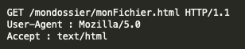
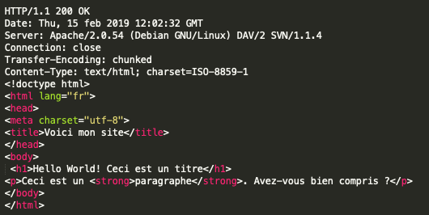
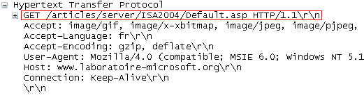

Revenons sur l'adresse qui s'affiche dans la barre d'adresse d'un navigateur web et plus précisément sur le début de cette adresse c'est-à-dire le "http"
Selon les cas cette adresse commencera par http ou https (nous verrons ce deuxième cas à la fin de cette activité).
Le protocole (un protocole est ensemble de règles qui permettent à 2 ordinateurs de communiquer ensemble) HTTP (HyperText Transfert Protocol) va permettre au client d'effectuer des requêtes à destination d'un serveur web. En retour, le serveur web va envoyer une réponse.

Voici une version simplifiée de la composition d'une requête HTTP (client vers serveur) :

- La méthode employée pour effectuer la requête
- L'URL de la ressource
- La version du protocole utilisé par le client (souvent HTTP 1.1)
- Le navigateur employé (Firefox, Chrome) et sa version
- Le type du document demandé (par exemple HTML)
...

Certaines de ces lignes sont optionnelles.

Voici un exemple de requête HTTP :

 

Nous avons ici plusieurs informations :
- GET est la méthode employée (voir ci-dessous)
- /mondossier/monFichier.html correspond l'URL de la ressource demandée
- HTTP/1.1 : la version du protocole est la 1.1
- Mozilla/5.0 : le navigateur web employé est Firefox de la société Mozilla
- text/html : le client s'attend à recevoir du HTML

Revenons sur la méthode employée :

Une requête HTTP utilise une méthode (c'est une commande qui demande au serveur d'effectuer une certaine action). Voici la liste des méthodes disponibles :

GET, HEAD, POST, OPTIONS, CONNECT, TRACE, PUT, PATCH, DELETE

Détaillons 4 de ces méthodes :

- GET : C'est la méthode la plus courante pour demander une ressource. Elle est sans effet sur la ressource.
- POST : Cette méthode est utilisée pour soumettre des données en vue d'un traitement (côté serveur). 
- DELETE : Cette méthode permet de supprimer une ressource sur le serveur.
- PUT : Cette méthode permet de modifier une ressource sur le serveur

Réponse du serveur à une requête HTTP

Une fois la requête reçue, le serveur va renvoyer une réponse, voici un exemple de réponse du serveur :

 

Voici quelques explications sur les éléments de cette réponse :

Commençons par la fin : le serveur renvoie du code HTML, une fois ce code reçu par le client, il est interprété par le navigateur qui affiche le résultat à l'écran. Cette partie correspond au corps de la réponse.

La 1ère ligne se nomme la ligne de statut :
HTTP/1.1 : version de HTTP utilisé par le serveur
200 : code indiquant que le document recherché par le client a bien été trouvé par le serveur. Il existe d'autres codes dont un que vous connaissez peut-être déjà : le code 404 (qui signifie «Le document recherché n'a pu être trouvé»).

Les 5 lignes suivantes constituent l'en-tête de la réponse :
une ligne nous intéresse plus particulièrement :

Server: Apache/2.0.54 (Debian GNU/Linux) DAV/2 SVN/1.1.4

Le serveur web qui a fourni la réponse http ci-dessus a comme système d'exploitation une distribution GNU/Linux nommée "Debian" (pour en savoir plus sur GNU/Linux, n'hésitez pas à faire vos propres recherches).

"Apache" est le coeur du serveur web puisque c'est ce logiciel qui va gérer les requêtes http (recevoir les requêtes http en provenance des clients et renvoyer les réponses http). Il existe d'autres logiciels capables de gérer les requêtes HTTP (nginx, lighttpd...) mais, aux dernières nouvelles, Apache est toujours le plus populaire puisqu'il est installé sur environ la moitié des serveurs web mondiaux ! 

Le "HTTPS" est la version "sécurisée" du protocole HTTP. Par "sécurisé" en entend que les données sont chiffrées avant d'être transmises sur le réseau. Seul le possesseur de la clé de déchiffrement sera en mesure de lire les données transmises sur le réseau. Il faut toujours vérifier que le protocole est bien utilisé (l'adresse commence par "https") avant de transmettre des données sensibles (coordonnées bancaires...). Si ce n'est pas le cas, passez votre chemin, car toute personne qui interceptera les paquets de données sera en mesure de lire vos données sensibles. 

QUESTIONS :
Voici le code affiché dans une console lors d' une requête HTTP :

1. Quelle est l'adresse (URL) du site visité? .
2. Quel est le type de fichier attendu ? 
3. Quel est le système d'exploitation de l'ordinateur personnel qui émet la requête?
4. Quel est le nom du navigateur utilisé et sa version? 

Le PageRank est l'algorithme d'analyse des liens concourant au système de classement des pages Web utilisé par le moteur de recherche Google. Il mesure quantitativement la popularité d'une page web. Le PageRank n'est qu'un indicateur parmi d'autres dans l'algorithme qui permet de classer les pages du Web dans les résultats de recherche de Google. Ce système a été inventé par Larry Page, cofondateur de Google. Ce mot est une marque déposée. 

Le principe de base est d'attribuer à chaque page une valeur (ou score) proportionnelle au nombre de fois que passerait par cette page un utilisateur parcourant le graphe du Web en cliquant aléatoirement, sur un des liens apparaissant sur chaque page. Ainsi, une page a un PageRank d'autant plus important qu'est grande la somme des PageRanks des pages qui pointent vers elle (elle comprise, s'il y a des liens internes). Le PageRank est une mesure de centralité sur le réseau du web. 

Plus formellement, le déplacement de l'utilisateur est une marche aléatoire sur le graphe du Web, c'est-à-dire le graphe orienté dont les sommets représentent les pages du Web et les arcs les hyperliens. L'algorithme suppose que l'utilisateur choisisse chaque lien indépendamment des pages précédemment visitées (le réalisme d'une telle hypothèse est discutable). 

#### Activité en groupe

1. créer un programme python simulant un lancé de dé à 6 faces. 
2. Partant de la page A, déplacez-vous dans le graphe en suivant le résultat du dé puis notez sur quelle page vous arrivez. 
3. Continuer cette marche jusqu'au signal de l'enseignant .
4. Compléter le tableau pagerank, donnant le nombre de visites sur chaque page.

#### Analyse
1. Compter, pour chaque page, le nombre de liens qui proviennent d'autres pages. 
2. "Plus une page a de liens qui viennent vers elle, plus le PageRank est élevé". En comaparant A, G et H, cette affirmation est-elle correcte. Même question pour A et D. Expliquer cela.  
3. Vous êtes l'auteur de la page H et vous souhaitez augmenter votre PageRank. Par quels moyens artificiels pouvez-vous augmenter ce score ? (vous aurez le droit d'ajouter des liens ou de créer de nouvelles pages). -->

Une petite vidéo pour cookie :

 <iframe style="width:100%;height:100%;position:absolute;left:0px;top:0px;overflow:hidden" frameborder="0" type="text/html" src="https://www.dailymotion.com/embed/video/x16lt53" width="100%" height="100%" allowfullscreen > </iframe> 

Deux ordinateurs en réseau peuvent s'échanger des données. Dans la plupart des cas ces échanges ne sont pas "symétriques" : en effet un ordinateur A va souvent se contenter de demander des ressources (fichiers contenant du texte, photos, vidéos, sons...) à un ordinateur B. L'ordinateur B va lui se contenter de fournir des ressources à tous les ordinateurs qui lui en feront la demande. On dira alors que l'ordinateur A (celui qui demande des ressources) est un client alors que l'ordinateur B (celui qui fournit les ressources) sera qualifié de serveur.  

Sur internet, ce modèle client/serveur domine assez largement, même s'il existe des cas où un ordinateur pourra jouer tour à tour le rôle de client et le rôle de serveur (exemple le "peer to peer", voir le module "Internet"), très souvent, des ordinateurs (les clients) passeront leur temps à demander des ressources à d'autres ordinateurs (les serveurs) . Par exemple, comme expliqué dans l'exemple ci-dessus on retrouve cet échange client/serveur à chaque fois que l'on visite une page web. Il y a de fortes chances pour que votre ordinateur personnel joue quasi exclusivement le rôle de client (sauf si vous êtes un adepte du "peer to peer"). 

N'importe quel type d'ordinateur peut jouer le rôle de serveur, mais dans le monde professionnel les serveurs sont des machines spécialisées conçues pour fonctionner 24h sur 24h. Ils peuvent aussi avoir une grosse capacité de stockage afin de stocker un grand nombre de ressources (vidéos, sons,...). 

Afin assurer une continuité de service, dans les sociétés, plusieurs serveurs assurent exactement le même rôle (on parle de redondance). Vous vous doutez bien que Google ne possède pas qu'un seul serveur, en effet, en moyenne, chaque seconde, c'est environ 65000 clients qui se connectent aux serveurs du moteur de recherche de Google. Aucun serveur, même extrêmement performant, ne serait capable de répondre à toutes ces requêtes. Google, Amazon ou encore Facebook possèdent un très grand nombre de serveurs afin de pouvoir satisfaire les demandes des utilisateurs en permanence. Ces entreprises possèdent d'immenses salles contenant chacune des centaines ou des milliers de serveurs (ces serveurs sont rangés dans des armoires appelées "baie serveur").  

 
