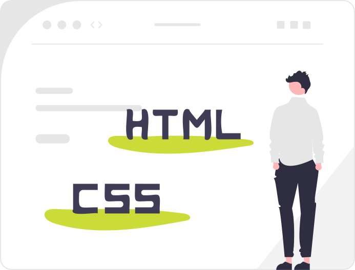

# Thème 1 : Le Web

Le Web (toile) désigne un système donnant accès à un ensemble de données (page, image, son, vidéo) reliées par des liens hypertextes et accessibles sur le réseau Internet.

{ .center width=50%}

[mail]: mailto:eric.madec@ecmorlaix.fr "eric.madec@ecmorlaix.fr"

## Initiation aux langages du Web : HTML/CSS

**Rejoindre** la classe sur <https://fr.khanacademy.org/join/JUVZ78CT>{:target="_blank"} pour **suivre** les leçons de la Khan Academy : [KhanAcademy, introduction à HTML/CSS](https://fr.khanacademy.org/computing/computer-programming/html-css){target=_blank} et en parallèle **copier/coller** vos codes dans des cellules MarkDown d'un [Notebook Jupyter](https://ericecmorlaix.github.io/adn-Tutoriel_lab_si/notebook/) avec l'application **Carnets** afin d'y **conserver** une trace de votre travail...

> - Pensez à enrichir vos codes avec vos explications personnelles.
> - A l'issue, transmettez votre notebook bilan personnel par [mail].

{ .center width=50%}

## Introduction au web

- En équipe, **regarder** chacun une des vidéos suivantes et **relever** les mots clefs et acronymes associés au thème du web ;

<iframe width="560" height="315" src="https://www.youtube-nocookie.com/embed/GqD6AiaRo3U" title="YouTube video player" frameborder="0" allow="accelerometer; autoplay; clipboard-write; encrypted-media; gyroscope; picture-in-picture" allowfullscreen></iframe>

<iframe width="560" height="315" src="https://www.youtube-nocookie.com/embed/RHljpE7pZh8" title="YouTube video player" frameborder="0" allow="accelerometer; autoplay; clipboard-write; encrypted-media; gyroscope; picture-in-picture" allowfullscreen></iframe>

<iframe width="560" height="315" src="https://www.youtube-nocookie.com/embed/bD6oideRbg8" title="YouTube video player" frameborder="0" allow="accelerometer; autoplay; clipboard-write; encrypted-media; gyroscope; picture-in-picture" allowfullscreen></iframe>

<iframe width="560" height="315" src="https://www.youtube-nocookie.com/embed/68TNDVJKjp0" title="YouTube video player" frameborder="0" allow="accelerometer; autoplay; clipboard-write; encrypted-media; gyroscope; picture-in-picture" allowfullscreen></iframe>

- **Comparer** vos rélevés avec ceux des autres membres de l'équipe et **compléter** votre liste d'apprentissage au format HTML ;

- **Transmettre** par [mail] un notebook jupyter contenant, au format HTML, la liste d'apprentissage complète commune à votre groupe ;

> - Indiquez sur ce document les prénoms de chaque membre de votre équipe ;
> - Ajoutez les membres de votre groupe en Copie Carbone du mail ;

<!-- - Comparer vos rélevés avec ceux des autres équipes et compléter votre liste. -->

## Publier un site Web

- Publication en ligne [sur **GitHub**, avec **Visual Studio Code** via **CodeSpaces**](../github)...

## Projet Web

Par équipe, afin de présenter l'un des sujets (notions) suivants en répondant à minima aux questions associées, développer chacun un site contenant le même contenu (au moins une page avec un titre et deux sous-titres, trois paragraphes, une images, une liste et un lien hypertexte) mais présenté dans des styles personnels différents et avec des liens renvoyant vers un des autres sites de l'équipe :

???+ example "Equipe A ([Lucie](){target=_blank}, [Luna](){target=_blank}, [Rose](){target=_blank}, [Louane](){target=_blank}) "
    !!! note "Sujet et notions"
        Web, site, www, w3c, surfer, toile, URL, HTTP/HTTPS, FTP/FTPS, index.html...
    
    ???- question "Questions"
        -	Que signifie URL
        -	Ça sert à quoi ?
        -	Quelles en sont les différentes parties ?
        -	Qu'est qu'une arborescence ?
        -	Comment chemine-t-on dans une arborescence ?
        -	Qu'est-ce qu'un chemin absolu ?
        -	Qu'est-ce qu'un chemin relatif ?
        -	Comment accéder au fichier index.html d'un site web ?
        -	Peut-on avoir une IP dans l'URL ?
        -	Qu'est-ce qu'un DNS, quel lien avec une URL ?
        -	Quels protocoles trouve-t-on dans une URL ?
        -	Quelles autres informations peut contenir l'URL ?
        -	Qu'est-ce qu'un lien hypertexte ?
        

???+ example "Equipe B ([Maïa](){target=_blank}, [Jeanne](){target=_blank}, [Mellie](){target=_blank}, [Ninon](){target=_blank})"
    !!! note "Sujet et notions"
        HTML, principales balises (h, p, br, body, title, head, ...), hypertexte, hyperlien, CSS, PNG (JPEG, JPG, SVG, GIF), XML...
    ???- question "Questions"
        - Donner la signification de HTML ?
        - Est-ce un langage de programmation ou de description ?
        - A quoi sert-il ?
        - Quels sont les marqueurs de ce langage ?
        - Lister les principales balises, à quoi servent-elles ?
        - Aujourd'hui, l'usage de quelle version de HTML est recommandée par le W3C ?
        - En quoi le HTML5 permet le web sémantique ?
        - Qu'est-ce que le MarkDown ?
        - Donner la signification de CSS ?
        - Est-ce un langage de programmation ou de description ?
        - Il sert à quoi ?
        - Quels sont les sélecteurs de ce langage ?
        - Quelle est la structure de son code ?
        - Aujourd'hui, l'usage de quelle version de CSS est recommandée par le W3C ?
        - Quels sont les trois façons (niveaux, endroits) pour appliquer du CSS à une page HTML ?
        - Qu'est que le Javascript ?

???+ example "Equipe C ([Hugo](){target=_blank}, [Antoine](){target=_blank}, [Thomas](){target=_blank}, [Walid](){target=_blank}, [Liam](){target=_blank}) **OU** Equipe D ([Elouan](){target=_blank}, [Mathieu](){target=_blank}, [Camille](){target=_blank}, [Aaron](){target=_blank}, [Enzo](){target=_blank})"
    !!! note "Sujet et notions"
        navigateurs (firefox, edge, opera, chrome, ...), moteurs de recherche (google, yahoo, bing, ...), cookies (aspect fonctionnel), référencement web (page rank)...
    ???- question "Questions"

???+ example "Equipe C ([Hugo](){target=_blank}, [Antoine](){target=_blank}, [Thomas](){target=_blank}, [Walid](){target=_blank}, [Liam](){target=_blank}) **OU** Equipe D ([Elouan](){target=_blank}, [Mathieu](){target=_blank}, [Camille](){target=_blank}, [Aaron](){target=_blank}, [Enzo](){target=_blank})"
    !!! note "Sujet et notions"
        Cloud, Base de données, big data, SQL, statistique de fréquentation, cookie (aspect informationnel), RGPD...
    ???- question "Questions"

???+ example "Equipe E ([Léanëlle](){target=_blank}, [Yüna](){target=_blank}, [Emma](){target=_blank}, [Elia](){target=_blank})"
    !!! note "Sujet et notions"
        Internet, IP, DNS, Client/serveur, machines connectées (PC, Smartphone, Tablette, IOT)...
    ???- question "Questions"
        - Internet ==  Web ?
        - Qu'est-ce qu'une requète ?
        - Que produit la commande `python -m http.server` ?
        - Que sont GET, POST, DELETE, PUT, ... ?
        - Que signifie les code 200, 404 qui sont visibles dans les logs d'un serveur web ?
        - Qu'est-ce que le "peer to peer" ?
        - Qu'est-ce qu'une page web statique ?
        - Quels langages permettent de rendre une page web statique interactive ?
        - Qu'est-ce qu'une page web dynamique ?
        - Quels langages permettent de rendre une page web dynamique ?
        - Quelle est l'utilité d'un web statique par rapport au dynamique et inversement ?
        
???+ example "Equipe F ([Wilona](){target=_blank},[Chloé](){target=_blank},[Lola](){target=_blank},[Luc](){target=_blank})"
    !!! note "Sujet et notions"
        Histoire du Web (et d'Internet), ARPANET, Tim Berner Lee, différents autres services aparentés (RS, Mail, Téléchargement, Streaming...)...
    ???- question "Questions"
***

<figure markdown>
  <figcaption markdown>
   _**SUITE EN CONSTRUCTION...**_
  </figcaption>
  { width="50%" .center }    
</figure>

## Restitution des projets Web

<!-- Maintenant que vous êtes devenus expert de votre sujet, il s'agit de l'expliquer à vos pairs en vous appuyant sur la présentation de votre site...  -->

## Les questions bilan du thème

<!-- A l'issue de toutes ces présentations portant sur le thème du Web, vous devriez êtres maintenant capable de répondre aux questions suivantes lors d'une évaluation prochaine...

 lister les questions qui pourrraient être posées en évaluation 

=== "Question :"
    Quel est la signification de l'acronyme HTML ?
=== "Réponse :"
    [HyperText Markup Language]() -->

<!-- Pour Archive
- HTML (Markdown, LaTeX, ...) [[Margaux](https://margplou.github.io/mon_premier_sitee/), [Emma](https://mamaa0.github.io/mon_premier_site/), [Salomé](https://samole21.github.io/MonPremierSite/)]

- CSS [[Laly](https://laly1303.github.io/mon_premier_cours-/), [Enora](https://emalgorn29.github.io/mon_premier_repertoire/)]

- URL (DNS) [[Manon](https://manongllrm.github.io/mon_permier_site/), [Lucas](https://lucasprigent.github.io/url-info/)]

- Clients / Serveurs + IP/MAC (Réseaux et Routage) [[Kathleen](https://kathleenmdn.github.io/mon_classeur/), [Perrine](https://perrinebrtn.github.io/mon-classeur/), [Louise](https://louiselegllx.github.io/Mon-site-Louise/), [Ambre](https://ambreguennec.github.io/mon-site-ambre/)]

- Cookies + Moteurs de recherche (Référencement, PageRank) [[Aksel](https://zeld119.github.io/Snt/), [Martin](https://martlem.github.io/Site-SNT-1/), [Mathys E](https://margouls.github.io/The-site-of-margouls/), [Nathan](https://babouchelamouette.github.io/mon_premier_site/)]

- Web Statique (JavaScript, PyScript) [[Mathys H](https://mathiouphm.github.io/mon_classeur/), [Gabriel](https://fichierapk.github.io/mon_premier_site/)]

- Web dynamique [[Laïs](https://lalaiham.github.io/mon_premier_site/), [Océane](https://babasqueo.github.io/mon_premier_sit/)]

- RGPD [[Louis](https://louisjouanet.github.io/mon_premier_site/), [Quentin](https://jincena.github.io/mon_premier_site/)]

- HTTP (HTTPS), TCP/IP (Protocole de transmissions) [[Keeyann](https://synyungboii.github.io/mon_premier_site/), [Alexandre](https://nbayoungfish.github.io/mon_site/), [Baptiste](https://carrotte1.github.io/Pingouin/)]

-->

<!-- Pour mémoire 
### Liste 1 (Maïa, Jeanne)
<h4>Le language html</h4>
<ul>
  <li>permet de créer un site web</li>
  <li>permet de marquer le contenu du site</li>
</ul>
<h5>Notions html</h5> 
<ol> 
  <li>Chaque site web commence par:!DOCTYPE html; indication qui permet d'indiquer au navigateur que cette page web est écrite en language html récent</li>
  <li>balise html, rôle différent: noter le titre ou le corps de texte.</li> 
  <li>informations entre balise début, renseignée par deux crochets et balise fin, renseignée par une barre oblique entre deux crochets</li>
  <li>balise head: contient des informations qui renseigne le navigateur</li>  
  <li>titre : balise title</li>
  <li>corps du texte : balise body</li>
  <li>6 balises pour les titres : de h1 à h6, du plus important au moins important</li>
  <li>Paragraphe : balise p</li>
  <li>saut de ligne: balise br, pas de balise de fin!!!</li>
</ol>
<h5><em> VOUS ETES PRETS !!!</em><h5>

***

### Liste 2 HATWL (Hugo, Antoine, Thomas, Walid, Liam)

> (manque les `</li>`)

<ul>
  <li> navigateur</li>
  <li> site web </li>
  <li> URL </li>
  <li> moteur de recherche </li>
  <li> reseau social </li>
  <li> messagerie électronique</li>
  <li> téléchargement </li>
  <li> cloud</li>
  <li> coockies</li>
  <li> liens</li>
  <li> algorythmes</li>
  <li> serveur web </li>
  <li> http </li>
  <li> HTML</li>
  <li> CSS</li>
<ul> 

***

### Liste 3 (Léanelle, Yüna, Emma, Elia)

<ul>
   <li>la différence entre internet et le web
    <ul>
    <li>internet c est un courrier éléctronique </li>
    <li> un échange de fichiers par FTP</li>
    <li>le streaming </li>
    <li>le web_</li>
    <li>internet c est le réseau qui permet de les transporter</li>
    </ul>
    <ul>
    <li>le web</li>
    <ul>b
    <li>un ensemble d information qui est constitué de milliards de document 
     reliées les uns aux autres</li>
    </ul>

***

### Liste 4 (Elouan Mathieu Camille Aaron Enzo)

<ul>
  <li>Internet</li>
  <li>Web = World Wide Web</li>
  <li>site</li>
  <li>serveur</li>
  <li>ordianteur</li>
  <li>hypertexte</li>
  <li>Serveur</li>
  <li>navigateur de recherche</li>
  <ul>
      <li>Firefox</li>
      <li>Microsoft Edge</li>
      <li>Opera GX</li>
      <li>Google Chrome</li>
  </ul>
  <li>client</li>
  <li>URL = lien d'un site web</li>
  <li>html + CSS</li>
  <li>index</li>
  <li>algorithme</li>
  <li>moteur de rechercher</li>
  <ul>
      <li> Google</li>
      <li>Yahoo</li>
      <li>Bing</li>
  </ul>
  <li>URL=adresse web unique de la page</li>
  <li>Tout le contenu de toutes les pages web est dans des serveurs</li>
  <li>Adresse ip=numéro d’identification attribué à une machine connectée à internet</li>
  <li>DNS=annuaire des adresses IP</li>
  <li>Requête HTTP=langage de communication utilisé par le navigateur et le serveur</li>
  <li>Cloud : accès à des services via une interface web</li>
  <li>ARPAnet 1969</li>
  <li>E-mails 1972</li>
  <li>Web 1991</li>
  <li>Tim Bernes-Lee créateur du W3C et le web</li>
</ul>

***

### Liste 5 (Wilona,Chloé,Lola,Luc)

> (manque un `</ol>`)

<ol> <li> LE WEB : </li>
<ul> <li> Liens </li>
<li> Traduit le language envoyé par nos serveurs </li>
<li> Première page web -> 1990 -> Tim Berners-Lee </li>
<li> Réseau d'informations: internet les transporte </li>
<li> Système -> données = page, texe, vidéo… </li>
<li> surfer -> passer de page en page </li>
<li> Toile d'araignée</li>
<li> Partie d'internet </li>
<li> Cloud -> accès à des services via une du WEB </li>
<li> W3C -> organisme à but non lucratif </li>
</ul>
<li> INTERNET: </li>
  <ul> <li> Ensemble de données </li>
  <li> Transfert de fichiers </li>
  <li> Moteur de recherche </li>
  <li> Internet -> réseau d'ordinateurs </li>
  <li> Courier électronique (email) </li>
  <li> Streaming </li>
  <li> Site WEB et non site internet </li>
  <li> Algorythme </li>
  <li> Adresse IP -> numéro d'identification attribué à une machine internet</li>
  <li> Internet ≠ WEB </li> </ul>
  <ul> <li> SERVEUR : </li>
  <li> Client </li>
  <li> Machine très puissante </li>
  <li> Base de données </li>
  <li> Ordinateurs qui fournissent les données </li>
  <li> Meta-données </li>
  <li> Interconnexion entre ordinateurs </li>
  <li> Centre de Recherche Nucléaire </li>
  </ul>
  <li> NAVIGATEUR : </li>
  <ul> <li> Client du web </li>
  <li> Logiciel qui affiche les pages WEB </li>
  <li> Navigateur ≠ moteur de recherche </li>
  <li> Moteur de recherche = site WEB qui permet aux utilisateurs de trouver un lien vers d'autres sites web </li>
  </ul>
  <li> LANGUAGE : </li>
  <ul> <li> Hypertexte </li>
  <li> Protocole HTTP </li>
  <li> Code CSS (feuille de style) </li>
  <li> Lien hypertexte -> permet d'accéder à un d'autres contenus </li>
  <li> HTLM </li>
  <li> XML </li>
  <li> PMG </li>
  </ul>
  <li> DATES :</li>
  <ul> <li> 1969 ARPAnet (ancetre de internet, reseau militaire/universitaire) </li>
  <li> 1972 -> Email </li>
  </ul>
</ol>
          
***

### Liste 6 (Lucie, Luna, Rose, Louane)

 <ul> <li> Web <li> reseau global <li> donnees <li> page web <li> navigateur <li> Moteur de recherche <li> URL <li> Adresse Ip <li> Serveur DNS <li> HTTP <li> HTML <li> Toile d’araignée <li>
Connexion entre les ordinateurs <li>Le web est une partie de internet <li> Cloud service ( stockage)<li> Web ->interface <li> ARPA NET -> 1969 <li> Email -> 1972 <li> Web -> 1991 -> Tim bernees Lee <li> Site web <li> Hypertexte <li> Navigateur <li> CSS 
     </ul>
-->